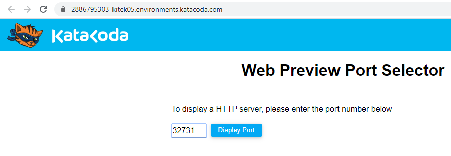

# TCC UAS

## NAMA : FELIX JEFRIAN FERY F
## NIM  : 175410038
## KELAS: TI-9

## Membuat sebuah Deployment menggunakan Python+Flask

Pod dalam Kubernetes adalah kumpulan dari satu atau banyak Container yang saling terhubung untuk kebutuhan administrasi dan jaringan. Deployment dalam Kubernetes selalu memeriksa kesehatan Pod dan melakukan restart saat Kontainer di dalam Pod tersebut mati. Deployment digunakan untuk membuat dan mereplikasi Pod.

Menggunakan perintah kubectl create untuk membuat Deployment. Pod menjalankan Container berdasarkan image docker yang digunakan. Disini saya menggunakan image docker riyans/riyansfery:v1 (image ini saya buat pada pertemuan 8, yang telah saya push ke Docker Hub). Pada Deployment ini Pod hanya memiliki 1 Container saja.

Your Interactive Learning Environment Bash Terminal

$
### $ start.sh
Starting Kubernetes...minikube version: v1.6.2
commit: 54f28ac5d3a815d1196cd5d57d707439ee4bb392
* minikube v1.6.2 on Ubuntu 18.04
* Selecting 'none' driver from user configuration (alternates: [])
* Running on localhost (CPUs=2, Memory=2461MB, Disk=47990MB) ...
* OS release is Ubuntu 18.04.3 LTS
* Preparing Kubernetes v1.17.0 on Docker '18.09.7' ...
  - kubelet.resolv-conf=/run/systemd/resolve/resolv.conf
* Pulling images ...
* Launching Kubernetes ...
* Configuring local host environment ...
* Done! kubectl is now configured to use "minikube"
* dashboard was successfully enabled
Kubernetes Started
### $ mkdir RiyansFery
### $ cd RiyansFery/
### $ nano app.py

    from flask import Flask
    from flask_restful import Resource, Api

    app = Flask(__name__)
    api = Api(app)

    class HelloWorld(Resource):
    def get(self):
        return {'FelixJefrian': '175410038'}

    api.add_resource(HelloWorld, '/')

    if __name__ == '__main__':
    app.run(debug=True, host='0.0.0.0')

### $ nano requirements.txt

    flask  
    flask_restful

### $ nano Dockerfile

    FROM python:2.7
    COPY . /app
    WORKDIR /app
    RUN pip install -r requirements.txt
    ENTRYPOINT ["python"]
    CMD ["app.py"] 

### $ docker build -t riyans/riyansfery:v1 .
Sending build context to Docker daemon  4.096kB
Step 1/6 : FROM python:2.7
2.7: Pulling from library/python
8f0fdd3eaac0: Pull complete
d918eaefd9de: Pull complete
43bf3e3107f5: Pull complete
27622921edb2: Pull complete
dcfa0aa1ae2c: Pull complete
ef6ca6913068: Pull complete
a755ea00feee: Pull complete
74b6f9ff9fd6: Pull complete
bebb4b693476: Pull complete
Digest: sha256:9517f5314968111658d229ed3038630a174e7a4f1b852bd185b70f614dffba08
Status: Downloaded newer image for python:2.7
 ---> 426ba9523d99
Step 2/6 : COPY . /app
 ---> 8531e96ffa99
Step 3/6 : WORKDIR /app
 ---> Running in 58cf968ab4c8
Removing intermediate container 58cf968ab4c8
 ---> e96459fc5b35
Step 4/6 : RUN pip install -r requirements.txt
 ---> Running in dd6da1ea9acb
DEPRECATION: Python 2.7 will reach the end of its life on January 1st, 2020. Please upgrade your Python as Python 2.7 won't be maintained after that date. A future version of pip will drop support for Python 2.7. More details about Python 2 support in pip, can be found at https://pip.pypa.io/en/latest/development/release-process/#python-2-support
Collecting flask
  Downloading https://files.pythonhosted.org/packages/9b/93/628509b8d5dc749656a9641f4caf13540e2cdec85276964ff8f43bbb1d3b/Flask-1.1.1-py2.py3-none-any.whl (94kB)
Collecting flask_restful
  Downloading https://files.pythonhosted.org/packages/17/44/6e490150ee443ca81d5f88b61bb4bbb133d44d75b0b716ebe92489508da4/Flask_RESTful-0.3.7-py2.py3-none-any.whl
Collecting itsdangerous>=0.24
  Downloading https://files.pythonhosted.org/packages/76/ae/44b03b253d6fade317f32c24d100b3b35c2239807046a4c953c7b89fa49e/itsdangerous-1.1.0-py2.py3-none-any.whl
Collecting Jinja2>=2.10.1
  Downloading https://files.pythonhosted.org/packages/65/e0/eb35e762802015cab1ccee04e8a277b03f1d8e53da3ec3106882ec42558b/Jinja2-2.10.3-py2.py3-none-any.whl (125kB)
Collecting click>=5.1
  Downloading https://files.pythonhosted.org/packages/fa/37/45185cb5abbc30d7257104c434fe0b07e5a195a6847506c074527aa599ec/Click-7.0-py2.py3-none-any.whl (81kB)
Collecting Werkzeug>=0.15
  Downloading https://files.pythonhosted.org/packages/ce/42/3aeda98f96e85fd26180534d36570e4d18108d62ae36f87694b476b83d6f/Werkzeug-0.16.0-py2.py3-none-any.whl (327kB)
Collecting aniso8601>=0.82
  Downloading https://files.pythonhosted.org/packages/eb/e4/787e104b58eadc1a710738d4e418d7e599e4e778e52cb8e5d5ef6ddd5833/aniso8601-8.0.0-py2.py3-none-any.whl (43kB)
Collecting pytz
  Downloading https://files.pythonhosted.org/packages/e7/f9/f0b53f88060247251bf481fa6ea62cd0d25bf1b11a87888e53ce5b7c8ad2/pytz-2019.3-py2.py3-none-any.whl (509kB)
Collecting six>=1.3.0
  Downloading https://files.pythonhosted.org/packages/65/26/32b8464df2a97e6dd1b656ed26b2c194606c16fe163c695a992b36c11cdf/six-1.13.0-py2.py3-none-any.whl
Collecting MarkupSafe>=0.23
  Downloading https://files.pythonhosted.org/packages/fb/40/f3adb7cf24a8012813c5edb20329eb22d5d8e2a0ecf73d21d6b85865da11/MarkupSafe-1.1.1-cp27-cp27mu-manylinux1_x86_64.whl
Installing collected packages: itsdangerous, MarkupSafe, Jinja2, click, Werkzeug, flask, aniso8601, pytz, six, flask-restful
Successfully installed Jinja2-2.10.3 MarkupSafe-1.1.1 Werkzeug-0.16.0 aniso8601-8.0.0 click-7.0 flask-1.1.1 flask-restful-0.3.7 itsdangerous-1.1.0 pytz-2019.3 six-1.13.0
Removing intermediate container dd6da1ea9acb
 ---> ab2ae6ede921
Step 5/6 : ENTRYPOINT ["python"]
 ---> Running in 288caa232095
Removing intermediate container 288caa232095
 ---> bf93969484d8
Step 6/6 : CMD ["app.py"]
 ---> Running in 6b68805e53b6
Removing intermediate container 6b68805e53b6
 ---> f138e78be83c
Successfully built f138e78be83c
Successfully tagged riyans/riyansfery:v1
### $ docker login
Login with your Docker ID to push and pull images from Docker Hub. If you don't have a Docker ID, head over to https://hub.docker.com to create one.
Username: riyans
Password:
WARNING! Your password will be stored unencrypted in /root/.docker/config.json.
Configure a credential helper to remove this warning. See
https://docs.docker.com/engine/reference/commandline/login/#credentials-store

Login Succeeded
### $ docker push riyans/riyansfery:v1
The push refers to repository [docker.io/riyans/riyansfery]
734ecb7265ea: Pushed
69379bb9a26b: Pushed
a98ea9b99554: Mounted from library/python
03a3dc679282: Mounted from library/python
35fc403d4c4c: Mounted from library/python
c1fbc35a2660: Mounted from library/python
f63773c65620: Mounted from library/python
e6d60910d056: Mounted from library/python
b52c1c103fae: Mounted from library/python
6f1c84e6ec59: Mounted from library/python
dd5242c2dc8a: Mounted from library/python
v1: digest: sha256:bde8baa03fd34c95a191e2d13356adc7bcc622792f8f1225406f7d63e9c3dd22 size: 2639

## Membuat sebuah Service

Secara default, Pod hanya bisa diakses melalui alamat IP internal di dalam cluster Kubernetes. Supaya Container python-flask bisa diakses dari luar jaringan virtual Kubernetes, saya harus ekspos Pod sebagai Service Kubernetes.

### $ kubectl create deployment python-flask--image=riyans/riyansfery:v1

OUTPUT : 
    
    deployment.apps/python-flask created

### $ kubectl get deployments

OUTPUT :

    NAME           READY   UP-TO-DATE   AVAILABLE   AGE
    python-flask   1/1     1            1           25s

### $ kubectl get pods

OUTPUT :

    NAME                           READY   STATUS RESTARTS   AGE
    python-flask-844c9fcfc-b5lgr   1/1     Running   0          64s

### $ kubectl expose deployment python-flask --type=LoadBalancer --port=5000

OUTPUT :

    service/python-flask exposed

### $ kubectl get services

OUTPUT :

    NAME           TYPE           CLUSTER-IP      EXTERNAL-IP   PORT(S)          AGE
    kubernetes     ClusterIP      10.96.0.1       <none>        443/TCP          14m
    python-flask   LoadBalancer   10.96.118.228   <pending>     5000:32731/TCP   20s
$

URL : https://2886795303-32731-kitek05.environments.katacoda.com/